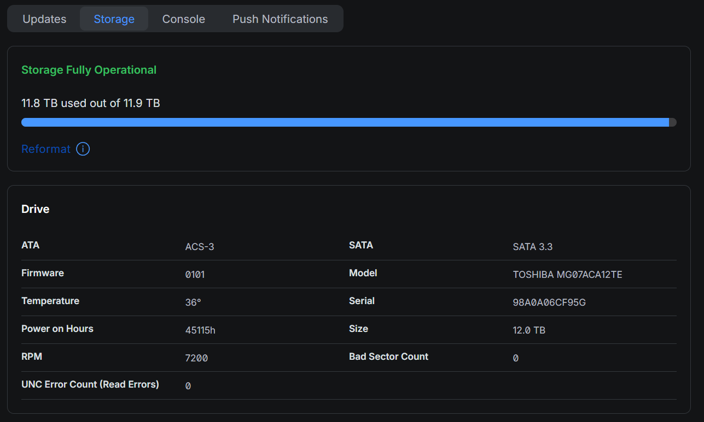
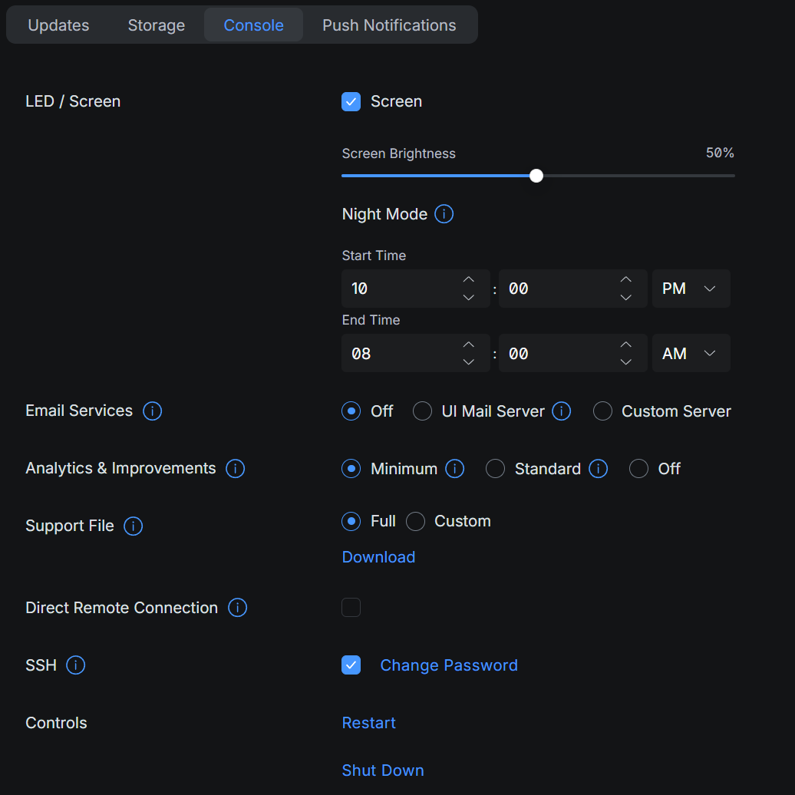

# UDM Pro Fan Control

Home Assistant custom integration for keeping UDM Pro fan PWM values at configured targets over SSH and exposing disk/fan telemetry as native Home Assistant entities.

The goal of this integration is to reduce the high internal temperatures caused by the UDM Pro quiet mode's low fan speeds. The main focus is the HDD's own temperature, which is especially important when using an industrial HDD designed for continuous operation.

This repository is structured for HACS as a custom integration. If you prefer a Supervisor App instead, use a separate Home Assistant Apps repository with `repository.yaml`; HACS and Supervisor Apps use different packaging models.

## Current status

This integration has been tested on a UDM-Pro. It may also work on other UDM variants that expose compatible Linux `hwmon` fan and temperature paths over SSH, but those devices may need different path settings.

UniFi switches are not currently supported. A USW-Pro-24-PoE-EU-US running firmware `7.4.1` was checked and did not expose the `/sys/class/hwmon/hwmon0/device/` path used by this integration.

The integration supports three control modes:

- `monitor`: read telemetry only and let the UniFi device manage its own fans.
- `fixed`: hold explicit PWM values, useful for quickly cooling the system without fan curve hysteresis lowering the speed again.
- `curve`: adjust PWM from configurable fan curves, useful when the device is installed in a well-ventilated place and does not need the same fan speed as a warmer cabinet or rack. PWM 1 is controlled from the HDD SMART temperature, while PWM 2 is controlled from the highest of the three configured hwmon temperature sensors. The curves use hysteresis when lowering fan speed, so they react quickly to heat but do not immediately drop back on small temperature changes.

The exact physical meaning of the three non-HDD hwmon temperature sensors is not currently documented here and may vary by UDM model or firmware version.

## Features

- Enforces target UDM Pro `pwm1` and `pwm2` values after reboots or firmware resets, with read-back verification after writes.
- Exposes HDD SMART temperature, hwmon temperatures, PWM state, fan RPM and watchdog status as Home Assistant entities.
- Adds writable `number` entities for PWM targets and polling interval.
- Uses SSH from Home Assistant; nothing is installed on the UDM Pro.
- Configurable sysfs and SMART paths for device variants.

## Entities

- `sensor.udm_pro_hdd_temperature`
- `sensor.udm_pro_temperature_1`
- `sensor.udm_pro_temperature_2`
- `sensor.udm_pro_temperature_3`
- `sensor.udm_pro_fan_1_speed`
- `sensor.udm_pro_fan_2_speed`
- `sensor.udm_pro_pwm_1` on the UDM Pro's native `0-255` PWM scale
- `sensor.udm_pro_pwm_2` on the UDM Pro's native `0-255` PWM scale
- `binary_sensor.udm_pro_fan_watchdog`
- `number.udm_pro_target_pwm_1`
- `number.udm_pro_target_pwm_2`
- `number.udm_pro_polling_interval`
- `number.udm_pro_smart_polling_interval`
- `number.udm_pro_curve_minimum_temperature`
- `number.udm_pro_curve_maximum_temperature`
- `number.udm_pro_curve_hysteresis`
- `number.udm_pro_pwm_1_curve_minimum`
- `number.udm_pro_pwm_1_curve_maximum`
- `number.udm_pro_pwm_2_curve_minimum`
- `number.udm_pro_pwm_2_curve_maximum`
- `select.udm_pro_control_mode`

## Installation with HACS

1. Add this repository to HACS as a custom repository of type `Integration`.
2. Install `UDM Pro Fan Control`.
3. Restart Home Assistant.
4. Go to Settings -> Devices & services -> Add integration.
5. Search for `UDM Pro Fan Control`.

## Manual installation

Copy the whole `custom_components/udm_pwm` directory into your Home Assistant `custom_components` directory, then restart Home Assistant.

For Home Assistant 2026.3 and newer, integration brand images are included in `custom_components/udm_pwm/brand`. If the integration works but the icon still shows as unavailable, clear the browser cache or force-refresh the Home Assistant frontend after restart.

## Configuration

The setup flow asks for:

- UDM Pro host or IP address
- SSH username
- SSH password
- Target PWM values
- Polling interval
- SMART polling interval
- Fan curve temperature limits
- Separate fan curve PWM limits for PWM 1 and PWM 2
- Fan curve hysteresis
- Optional sysfs paths and SMART device path

Default values:

- Host: `192.168.1.1`
- Username: `root`
- PWM 1: `160`
- PWM 2: `140`
- Polling interval: `60` seconds
- SMART polling interval: `300` seconds
- Curve temperature range: `35` to `45 °C`
- Curve hysteresis: `2 °C`
- Curve PWM 1 range: `120` to `200`
- Curve PWM 2 range: `120` to `200`
- PWM paths: `/sys/class/hwmon/hwmon0/device/pwm1`, `/sys/class/hwmon/hwmon0/device/pwm2`
- Fan RPM paths: `/sys/class/hwmon/hwmon0/device/fan1_input`, `/sys/class/hwmon/hwmon0/device/fan2_input`
- Temperature paths: `/sys/class/hwmon/hwmon0/device/temp1_input`, `/sys/class/hwmon/hwmon0/device/temp2_input`, `/sys/class/hwmon/hwmon0/device/temp3_input`
- SMART disk: `/dev/sda`

## UniFi setup reference

You can verify the drive's own reported temperature in the UniFi OS UI under `Storage`. This is the value the integration reads from SMART and exposes in Home Assistant.



SSH access and the SSH password are configured in the UniFi OS console settings under `Console`.



## Finding device paths over SSH

Different UDM variants and firmware versions may expose fan and temperature files under different `hwmon` paths. SSH into the device and list the available sensors:

```sh
ls /sys/class/hwmon/hwmon0/device/
```

Read the current PWM, fan RPM and temperature values:

```sh
cat /sys/class/hwmon/hwmon0/device/pwm1
cat /sys/class/hwmon/hwmon0/device/pwm2
cat /sys/class/hwmon/hwmon0/device/fan1_input
cat /sys/class/hwmon/hwmon0/device/fan2_input
cat /sys/class/hwmon/hwmon0/device/temp1_input
cat /sys/class/hwmon/hwmon0/device/temp2_input
cat /sys/class/hwmon/hwmon0/device/temp3_input
```

Temperature files often report millidegrees Celsius, so `38000` means `38 °C`.

To find all matching files if your device does not use `hwmon0`:

```sh
find /sys/class/hwmon -name 'pwm*' -o -name 'fan*_input' -o -name 'temp*_input' -o -name 'name'
```

To check the HDD SMART temperature manually:

```sh
smartctl -A /dev/sda | grep -E '^(190|194)|Temperature'
```

## Security notes

This integration needs SSH access that can read and write the UDM Pro fan sysfs paths and run `smartctl`. The password is stored by Home Assistant in the config entry storage, not in the integration source code.

The first version uses Paramiko's automatic host-key acceptance. For public use, prefer a dedicated local-only UDM Pro account or a constrained environment where SSH access is trusted.

## Development disclosure

This integration was developed with assistance from OpenAI Codex and validated on a UDM-Pro before release.
